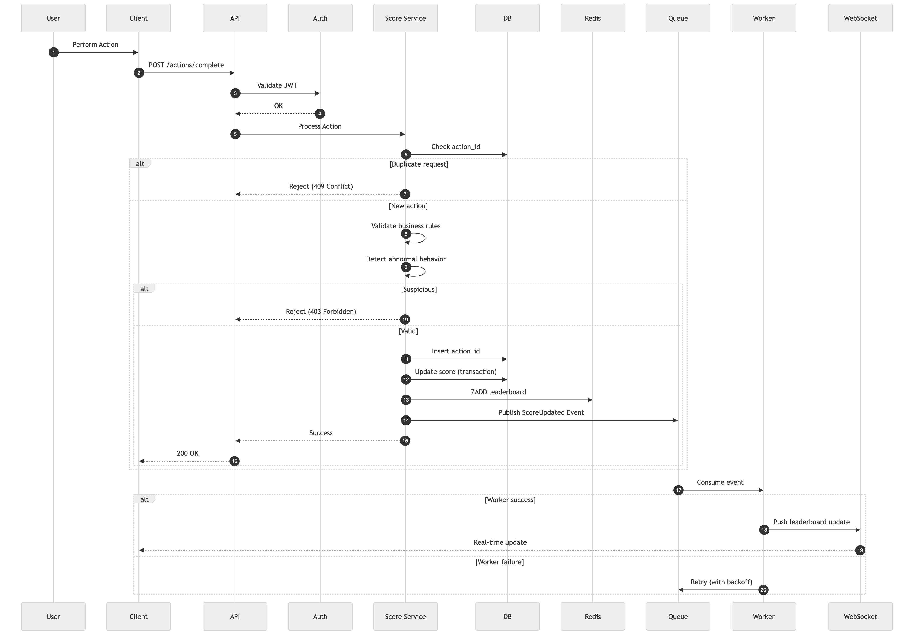

# 🚀 Problem 6: Architecture – Real-time Scoreboard System

---

# 1. Goal
Design a **secure, scalable, real-time leaderboard system** that:

- Displays **Top 10 users**
- Updates **in real-time**
- Handles **high traffic (10K → 1M users)**
- Prevents **cheating / malicious score injection**

---

# 2. Architecture Principles

- **Zero trust client** → never trust frontend (security principle): we should not rely on any data sent from the client, because it can be modified or faked by users
- **Server is source of truth** → All scoring logic is computed on backend.
- **Event-driven** → scalable & decoupled: Event-driven (architectural style) means services communicate through events instead of direct calls, which makes the system easier to scale and decoupled.
- **Stateless services** → horizontal scaling: Stateless services (design principle) eliminate server-side session dependency, enabling seamless horizontal scaling and better fault tolerance in distributed systems.
- **Cache-first read** → performance: Cache-first read (design principle) improves performance because data can be returned much faster from memory than from the database
- **Idempotent writes** → avoid duplication: By using an idempotency key, the server can detect repeated requests and prevent duplicate updates, which is important for reliability.

---

# 3. High-Level Architecture


---

# 4. Sequence Diagram (Score Update)



| Step | Description |
|------|------------|
| 1 | The user triggers an action (e.g., completes a task). |
| 2 | The client sends a request to the backend API. |
| 3 | The load balancer distributes the request to an available API instance. |
| 4 | The API verifies the user’s identity using JWT. |
| 5 | The API delegates business logic to the Score Service. |
| 6 | The system checks whether this request was already processed. |
| 7 | If the action_id already exists, the request is rejected. |
| 8 | The system verifies if the action is valid. |
| 9 | The system detects abnormal or suspicious behavior. |
| 10 | If suspicious behavior is detected, the request is rejected. |
| 11 | The system stores the action_id to ensure idempotency. |
| 12 | The system updates the user’s score (source of truth). |
| 13 | The system updates the leaderboard in cache. |
| 14 | The system publishes a “ScoreUpdated” event. |
| 15 | The API returns a success response immediately. |
| 16 | The queue sends the event to a worker/consumer. |
| 17 | The worker handles the event asynchronously. |
| 18 | The worker sends updated data to the WebSocket server. |
| 19 | The WebSocket server pushes real-time updates to the client. |
| 20 | The client updates the leaderboard instantly. |

---

# 5. API Contract

## 5.1 GET Leaderboard

```
GET /api/v1/leaderboard?limit=10
```

Headers:

```
Authorization: Bearer <JWT>
```
Response:

```json
{
  "data": [
    { "user_id": "u1", "score": 1200, "rank": 1 },
    { "user_id": "u2", "score": 1100, "rank": 2 }
  ],
  "timestamp": 1710000000
}
```

Status Codes:

```
200 OK → success
401 Unauthorized → invalid or missing JWT
```

---

## 5.2 Update Score

```
POST /api/v1/actions/complete
```

Headers:

```
Authorization: Bearer <JWT>
Content-Type: application/json
X-Action-Nonce: <unique-idempotency-key>
```

Request:

```json
{
  "action_id": "uuid",
  "action_type": "TASK_COMPLETE",
  "metadata": {}
}
```

Response:
- 200 OK → { "score": number, "rank": number }
- 400 Bad Request → invalid payload or nonce reused
- 401/403 → auth failure
- 409 Conflict → stale version, client should retry

**Client DOES NOT send score**

---

# 6. Security & Anti-Cheat (Deep Design)

## 6.1 Threat Model

| Threat | Solution |
|------|--------|
| Fake API calls | JWT + signature |
| Replay attack | Idempotency key |
| Spam requests | Rate limiting |
| Score tampering | Server-side calc |
| Bot abuse | Behavior analysis |

---

## 6.2 Core Rules

- Score is **computed ONLY on backend**
- Each action must be **verifiable**
- Use **idempotency key (action_id)**

---

# 7. Performance Design

## 7.1 Redis Leaderboard (Critical)

```
ZADD leaderboard score user_id
ZREVRANGE leaderboard 0 9 WITHSCORES
```

Time complexity: **O(log N)**

---

## 7.2 Read Flow

```
Client → API → Redis → Response
```

Fallback:

```
Redis fail → DB → rebuild cache
```

---

## 7.3 Write Flow

```
API → DB (source of truth)
    → Redis (cache)
    → Queue (event)
```

---

# 8. Scalability Strategy

## Stage 1 (10K users)
- Single DB
- Redis leaderboard
- WebSocket server

## Stage 2 (100K users)
- Read replicas for DB
- Partition leaderboard
- Horizontal API scaling

## Stage 3 (1M+ users)
- Sharding DB
- Distributed Redis Cluster
- Kafka for high throughput

---

# 9. Data Model

## users
```
id (PK)
name
created_at
```

## scores
```
user_id (PK)
score
updated_at
```

## actions
```
action_id (PK)
user_id
status
created_at
```

Used for **idempotency + anti-cheat**

---

# 10. Observability

- Logging: ELK
- Metrics: Prometheus
- Tracing: OpenTelemetry

Key metrics:
- API latency
- Redis hit rate
- Fraud attempts

---

# 11. Failure Handling

- Retry queue events
- Circuit breaker
- Graceful degradation (no realtime → polling)

---

# 12. Trade-offs

| Option | Pros | Cons |
|------|------|------|
| Strong consistency | Accurate | Slow |
| Eventual consistency | Fast | Slight delay |

Choose: **Eventual consistency + realtime push**

---

# 13. Future Enhancements

- Daily / Weekly leaderboard
- Friend ranking
- AI cheat detection
- Gamification system

---

# 14. Final Conclusion

This system is:

- Secure (anti-cheat)
- Fast (Redis + realtime)
- Scalable (event-driven)
- Production-ready (observability + failure handling)

---
